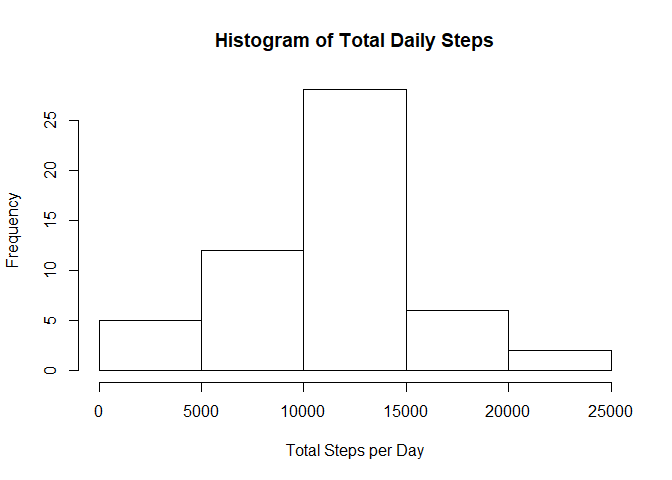
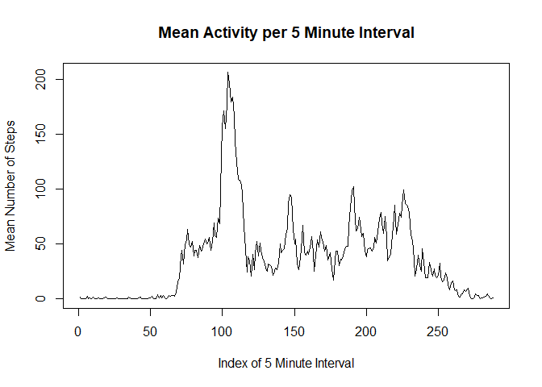
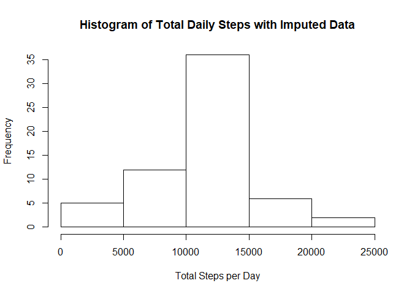
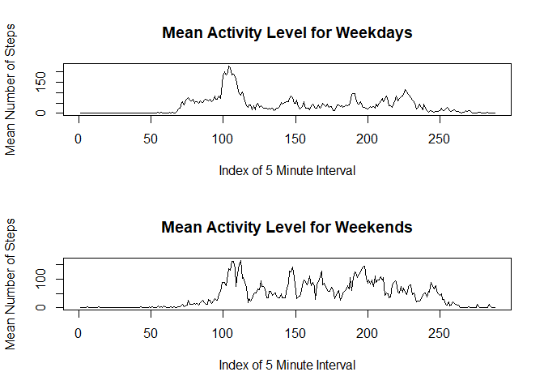

## Loading and Preprocessing the Data
The data file is provided in a zip archive. The R code unzips the file and loads the unzipped csv into a variable called activity.

```r
unzip("activity.zip")
if (file.exists("activity.csv")){
    activity <- read.csv("activity.csv")
}
```
The data contains dates which are represented as strings. The next step is to convert them to R Date objects.

```r
activity$date <- as.Date(activity$date)
```

The last step of preprocessing is to create a copy of the data frame without missing values in the "steps" column.

```r
activity_no_na <- subset(activity, !is.na(activity$steps))
```

## What is mean total number of steps taken per day?
First the dplyr library is loaded in order to group the entries by date and sum the number of steps for each date.

```r
library(dplyr)
daily_total <- activity_no_na %>%
    group_by(date) %>%
    summarize(total = sum(steps))
```

The following line creates a histogram of the total steps per day.

```r
hist(daily_total$total, main = "Histogram of Total Daily Steps", xlab = "Total Steps per Day")
```

<!-- -->

We can also calculate the mean and median of the daily total steps.

```r
mean_total_steps <- mean(daily_total$total)
median_total_steps <- median(daily_total$total)
```
The mean value is 10766.19 and the median value is 10765.

## What is the average daily activity pattern?
A new data frame is created by grouping by interval and finding the mean for each of these intervals. This means that there will be a mean value for the number of steps taken in that specific five minute interval across all days of the original data set.

```r
activity_pattern <- activity_no_na %>%
    group_by(interval) %>%
    summarize(mean_steps = mean(steps))
```

The next line plots the mean number of steps for each 5 minute interval. An important thing to notice is that the intervals are treated as normal integers, so using them for the x axis of the plot is problematic because they have discontinuities. For example, between 55 and 100 (which represents the interval from 0:55 to 1:00), there are actually 45 integers between these two numbers, so the graph would have a wider line for those five minutes than it would for any five minutes not on an hour boundary. As a result, I have chosen to use the index value of the interval (1-288) to represent the 288 equally spaced 5 minute intervals that occur in one day.

```r
plot(activity_pattern$mean_steps, type = "l", main = "Mean Activity per 5 Minute Interval", 
     xlab = "Index of 5 Minute Interval", ylab = "Mean Number of Steps")
```

<!-- -->

The interval containing the max number of steps on average can be found using the which.max function.

```r
max_steps_interval <- activity_pattern$interval[which.max(activity_pattern$mean_steps)]
```
The interval containing the max number of steps on average is 835.

## Imputing Missing Values
The next task is to impute values for the rows which have missing step counts. This is accomplished by first creating a new data frame that is a copy of the original. Then a logical vector is created to index the rows with NAs.

```r
activity_impute <- activity
na_vals <- is.na(activity$steps)
```

The next two lines perform the following actions:  
1. Use the logical vector of all of the rows containing NA to create a vector of intervals.  
2. Use the vector created in the previous step to find the corresponding index of that interval in the activity_pattern data frame, which contains the mean number of steps for that interval.  
3. Use the vector of indices to lookup the mean step count for that specific interval in the activity_pattern data frame and place it in the corresponding row of the new data frame in place of the NA.  
The result is that the new data frame contains the mean value for the respective interval which previously had the NA.

```r
match_indices <- match(activity$interval[na_vals], activity_pattern$interval)
activity_impute$steps[na_vals] <- activity_pattern$mean_steps[match_indices]
```

The code to obtain the total number of steps per day from above is repeated for this new data fram with imputed values and a histogram is created. By using the average value for each interval that had an NA before, the overall histogram hasn't noticeably changed.

```r
daily_total_impute <- activity_impute %>%
    group_by(date) %>%
    summarize(total = sum(steps))
hist(daily_total_impute$total, main = "Histogram of Total Daily Steps with Imputed Data", xlab = "Total Steps per Day")
```

<!-- -->

Calculating the mean and median value for the total steps per day of the imputed data set results in the same mean and almost the same median value.

```r
mean_total_steps_impute <- mean(daily_total_impute$total)
median_total_steps_impute <- median(daily_total_impute$total)
```
The mean value is 10766.19 and the median value is 10766.19.

## Are there differences in activity patterns between weekdays and weekends?
In order to analyze the differences between weekday activity and weekend activity, it is necessary to create a variable to record whether a row is a weekday or weekend.  
The following code adds a weekday variable to the imputed data set which is a factor determined using the weekdays function. After that, the data is grouped by the interval and weekday columns, and then the mean of those groups is calculated, so we have the mean for each interval for weekdays as well as weekend days.

```r
activity_impute$weekday <- factor(ifelse(weekdays(activity_impute$date) != "Sunday" & 
                                         weekdays(activity_impute$date) != "Saturday", "weekday", "weekend"))
activity_pattern_byday <- activity_impute %>% 
    group_by(interval, weekday) %>% 
    summarize(mean_steps = mean(steps))
```

The next step is to filter the data set to have separate data sets for weekdays and weekends.

```r
activity_pattern_weekdays <- activity_pattern_byday %>%
    filter(weekday == "weekday")
activity_pattern_weekends <- activity_pattern_byday %>%
    filter(weekday == "weekend")
```

Lastly, the weekday and weekend data is plotted together in a panel plot showing the average number of steps at each time interval but split into weekday and weekend days. These graphs also use the index of the interval in the x axis to avoid the problem explained above regarding the discontinuities of the integer interval data.

```r
par(mfrow = c(2,1))
plot(activity_pattern_weekdays$mean_steps, type = "l", main = "Mean Activity Level for Weekdays", 
     xlab = "Index of 5 Minute Interval", ylab = "Mean Number of Steps")
plot(activity_pattern_weekends$mean_steps, type = "l", main = "Mean Activity Level for Weekends", 
     xlab = "Index of 5 Minute Interval", ylab = "Mean Number of Steps")
```

<!-- -->
